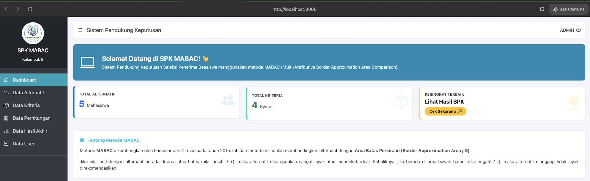
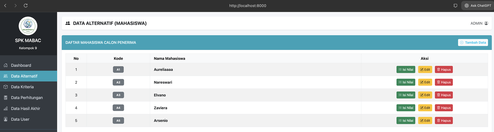
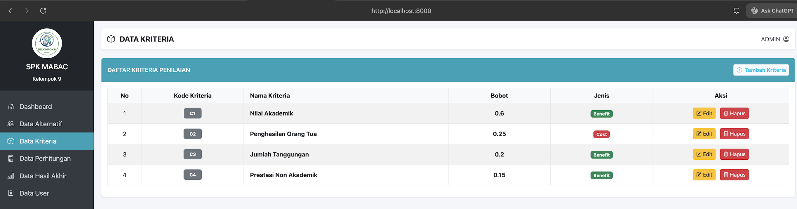
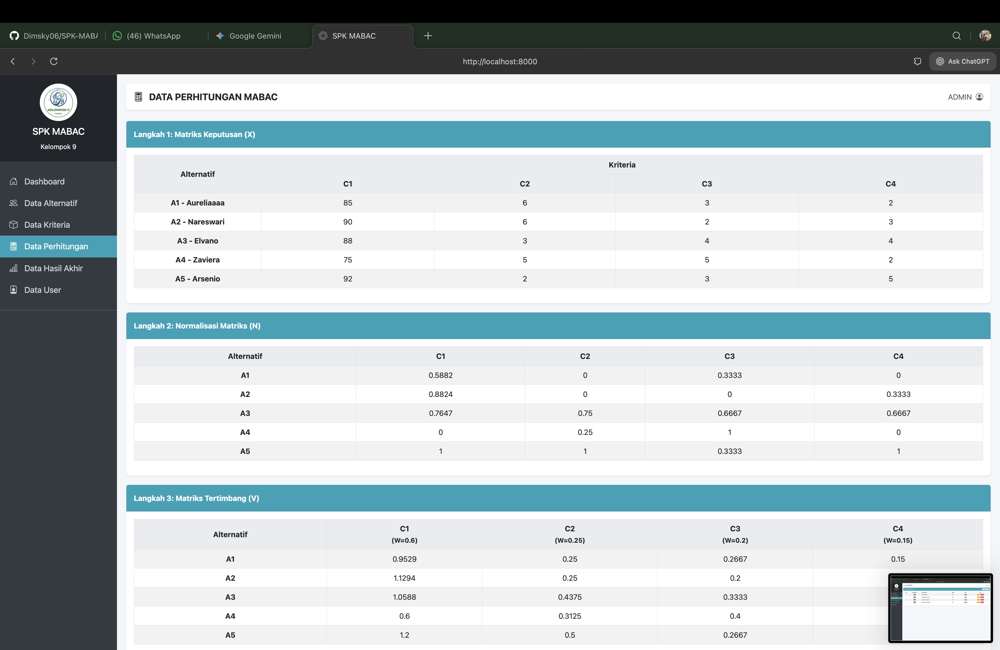
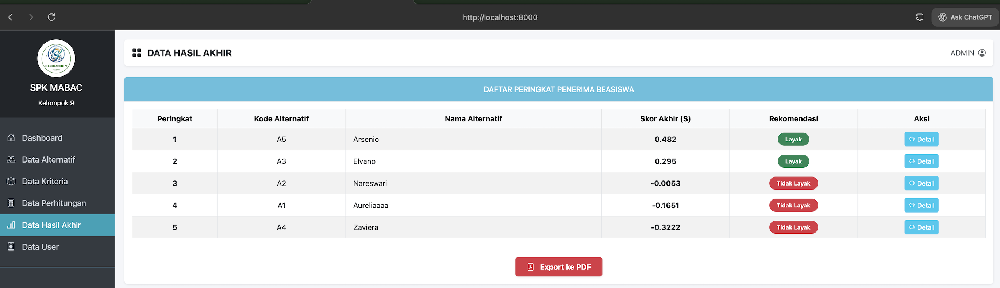
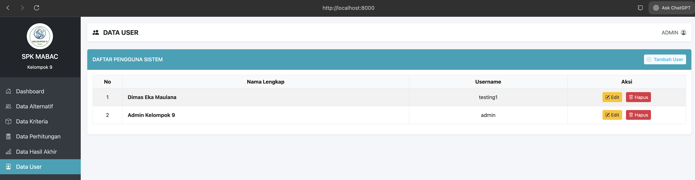

# 🎓 SPK MABAC (Decision Support System)

> **Web-Based Decision Support System for Scholarship Selection using the MABAC Method**

---

## 📖 About The Project

This Decision Support System (DSS) is a web-based application designed to assist educational institutions in determining the most eligible candidates for scholarships. 

In practice, the scholarship selection process often faces challenges such as a large number of applicants and diverse criteria (e.g., academic achievements, economic conditions, and student activity). Manual selection can lead to subjectivity. Therefore, this system was built using the **MABAC (Multi-Attributive Border Approximation Area Comparison)** method to process alternative data and criteria. This quantitative approach ensures the decision-making process is objective, systematic, transparent, and measurable.

This project was developed as a course project by Group 9.

---

## 🚀 Key Features

* ✅ **Interactive Dashboard**: Displays a summary of total data and a brief literature guide on the MABAC method.
* ✅ **Alternative Data Management**: CRUD operations for managing student data (candidates) and directly inputting their evaluation scores.
* ✅ **Criteria Management**: Configuration for assessment parameters, allowing administrators to define the weight (W) and attribute type (Benefit or Cost).
* ✅ **Transparent Calculation Engine**: A step-by-step display of the MABAC methodology.
* ✅ **Final Result & Ranking**: Automatically generates a ranked list classifying candidates as eligible or not eligible.
* ✅ **Secure User Management**: Admin access control with MD5 encrypted passwords.

---

## 📸 Application Gallery

Here is a glimpse of the SPK MABAC user interface:

| Dashboard | Alternative Data |
| :---: | :---: |
|  |  |

| Criteria Data | Calculation Process |
| :---: | :---: |
|  |  |

| Final Ranking Result | User Management |
| :---: | :---: |
|  |  |

---

## 🔬 Case Study & Calculation Process

The data used in this project is based on a simulated case study for scholarship selection. 

### 1. Criteria and Weights
Each criterion has a different level of importance expressed in weights (Total weight = 1.00 or 100%).

| Code | Criteria | Type | Weight (W) |
| :---: | :--- | :---: | :---: |
| **C1** | Academic Score | Benefit | 0.30 |
| **C2** | Parents' Income | Cost | 0.25 |
| **C3** | Number of Dependents | Benefit | 0.20 |
| **C4** | Non-Academic Achievements | Benefit | 0.15 |
| **C5** | Organizational Activity | Benefit | 0.10 |

### 2. Assessment Scale
To facilitate the calculation, several criteria were converted into a numbered scale (except C1, which uses the original academic score from 0-100).
* **C2 (Cost)**: 2 (Very Low), 3 (Low), 4 (Medium), 5 (High), 6 (Very High). *Smaller is better.*
* **C3 (Benefit)**: 2 (Few), 3 (Medium), 4 (Many), 5 (Very Many). *Larger is better.*
* **C4 (Benefit)**: 2 (Low), 3 (Sufficient), 4 (High), 5 (Very High).
* **C5 (Benefit)**: 3 (Less Active), 4 (Active), 5 (Very Active).

### 3. Initial Decision Matrix (X)
The initial representation of alternative values against each criterion.

| Alternative | C1 | C2 | C3 | C4 | C5 |
| :--- | :---: | :---: | :---: | :---: | :---: |
| **A1 (Aurelia)** | 85 | 4 | 3 | 2 | 4 |
| **A2 (Nareswari)** | 90 | 6 | 2 | 3 | 3 |
| **A3 (Elvano)** | 88 | 3 | 4 | 4 | 5 |
| **A4 (Zaviera)** | 75 | 5 | 5 | 2 | 4 |
| **A5 (Arsenio)** | 92 | 2 | 3 | 5 | 3 |

### 4. Normalized Matrix (N)
Normalizing the decision matrix to equalize the scale based on the criteria type (Benefit or Cost).
* **Benefit Formula:** $$n_{ij}=\frac{x_{ij}-x^{-}_{j}}{x^{+}_{j}-x^{-}_{j}}$$
* **Cost Formula:** $$n_{ij}=\frac{x_{ij}-x^{+}_{j}}{x^{-}_{j}-x^{+}_{j}}$$

| Alternative | C1 | C2 | C3 | C4 | C5 |
| :--- | :---: | :---: | :---: | :---: | :---: |
| **A1** | 0.5882 | 0.5000 | 0.3333 | 0.0000 | 0.5000 |
| **A2** | 0.8824 | 0.0000 | 0.0000 | 0.3333 | 0.0000 |
| **A3** | 0.7647 | 0.7500 | 0.6667 | 0.6667 | 1.0000 |
| **A4** | 0.0000 | 0.2500 | 1.0000 | 0.0000 | 0.5000 |
| **A5** | 1.0000 | 1.0000 | 0.3333 | 1.0000 | 0.0000 |

### 5. Weighted Matrix (V)
Multiplying the normalized value by the criteria weight plus the weight itself. 
* **Formula:** $$v_{ij}=w_{j}\cdot(n_{ij}+1)$$

| Alternative | C1 | C2 | C3 | C4 | C5 |
| :--- | :---: | :---: | :---: | :---: | :---: |
| **A1** | 0.4765 | 0.3750 | 0.2667 | 0.1500 | 0.1500 |
| **A2** | 0.5647 | 0.2500 | 0.2000 | 0.2000 | 0.1000 |
| **A3** | 0.5294 | 0.4375 | 0.3333 | 0.2500 | 0.2000 |
| **A4** | 0.3000 | 0.3125 | 0.4000 | 0.1500 | 0.1500 |
| **A5** | 0.6000 | 0.5000 | 0.2667 | 0.3000 | 0.1000 |

### 6. Border Approximation Area (G) & Distance Matrix (Q)
The border area (G) is determined from the geometric mean of the weighted values. The distance (Q) is calculated by subtracting G from V.

| Value | C1 | C2 | C3 | C4 | C5 |
| :--- | :---: | :---: | :---: | :---: | :---: |
| **Border (G)** | **0.483** | **0.365** | **0.286** | **0.198** | **0.134** |
| **A1** | -0.006 | 0.010 | -0.019 | -0.048 | 0.016 |
| **A2** | 0.082 | -0.115 | -0.086 | 0.002 | -0.034 |
| **A3** | 0.046 | 0.073 | 0.047 | 0.052 | 0.066 |
| **A4** | -0.183 | -0.052 | 0.114 | -0.048 | 0.016 |
| **A5** | 0.117 | 0.135 | -0.019 | 0.102 | -0.034 |

### 7. Final Score and Ranking

| Ranking | Alternative | Name | Final Score (Q) |
| :---: | :---: | :--- | :---: |
| 🥇 **1** | **A5** | **Arsenio** | **0.301** |
| 🥈 **2** | **A3** | **Elvano** | **0.284** |
| 🥉 **3** | A4 | Zaviera | -0.153 |
| **4** | A1 | Aurelia | -0.047 |
| **5** | A2 | Nareswari | -0.151 |

**Conclusion:** Based on the MABAC calculation, **Alternative A5 (Arsenio)** obtained the highest final score (0.301) and is ranked first as the most eligible scholarship recipient, followed by A3 (Elvano). This proves that the MABAC method successfully provides objective recommendations based on all predetermined criteria.

---

## 🛠️ Tech Stack

* **Programming Language**: PHP (Native)
* **Database**: MySQL
* **Frontend Framework**: HTML5, CSS3, Bootstrap 5
* **Method**: MABAC (Multi-Attributive Border Approximation Area Comparison)

---

## 👥 Development Team (Group 9)

This project was developed by:

* 👨‍💻 **Dimas Eka Maulana** (2407411017)
* 👨‍💻 **Muhammad Daffa Syarif Syaddad** (2407411001)
* 👩‍💻 **Sifadilla Nurul ‘Aini** (2407411018)

---

  Made with ❤️ by Group 9

